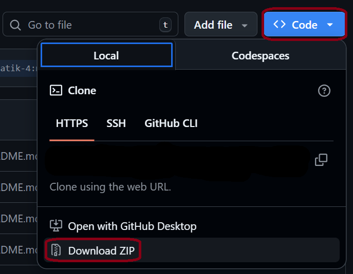

# mealPlannerTemplate
meal planner template for git4 @ hsd inflab

how to download:

or via git clone

**Project Structure:**

`src/main/java`

  `/frontend`: all JavaFX components and anything related
  
  `/frontend/pages`:  all rendered frontend pages

  `/hsd/inflab/smp`: Main.java (program entry point)

  `/models`: model classes (components of which objects are created during runtime)

  `/services`: classes that provide some type of service within the program

`src/main/java/resources`: persistence data and configuration files

`src/test/java`: Unit Tests 
